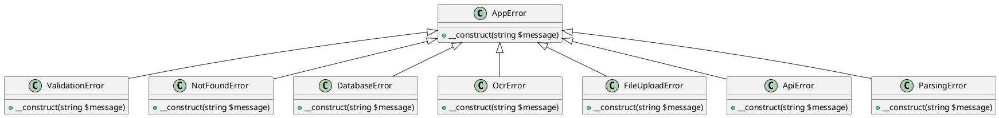

# Errors Class Diagram

```plantuml
@startuml
class AppError {
    +__construct(string $message)
}

class ValidationError {
    +__construct(string $message)
}

class NotFoundError {
    +__construct(string $message)
}

class DatabaseError {
    +__construct(string $message)
}

class OcrError {
    +__construct(string $message)
}

class FileUploadError {
    +__construct(string $message)
}

class ApiError {
    +__construct(string $message)
}

class ParsingError {
    +__construct(string $message)
}

AppError <|-- ValidationError
AppError <|-- NotFoundError
AppError <|-- DatabaseError
AppError <|-- OcrError
AppError <|-- FileUploadError
AppError <|-- ApiError
AppError <|-- ParsingError
@enduml
```
